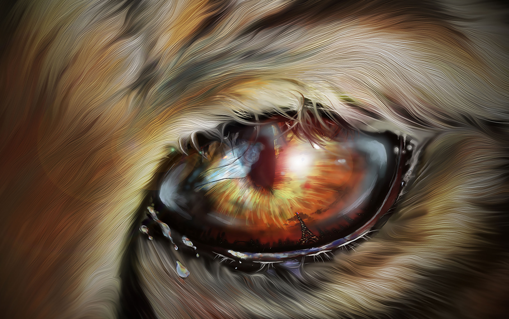

  

  # Frédérique Charton — CALLISTO

  **Gérante & graphiste chez GPO SARL · Artiste numérique · Développeuse full-stack & IA en formation · [Demoscener](https://demozoo.org/sceners/57855/)**

  

  Œuvre originale de CALLISTO · Original artwork by CALLISTO

  *She · Châlons-en-Champagne, France*

  [Français](#fr) · [English](#en)

  
  
  
  
  

---

# Français

## À propos

Je travaille à l’intersection du **design graphique**, de l’**illustration**, du **développement web** et de l’**intelligence artificielle**. Je transforme des concepts en identités visuelles, interfaces, supports imprimés et expériences numériques utiles et mémorables.

Depuis 2012, je dirige **GPO SARL**, entreprise spécialisée dans la vente, la location, la réparation et la restauration de flippers, bornes d’arcade et jeux événementiels. J’y assure également la communication visuelle, la création graphique et la rénovation esthétique des machines.

Avec **Graph2Print**, je développe des projets de création graphique et d’impression personnalisée : identité visuelle, supports promotionnels, stickers, marquage et décors sur mesure.

## Compétences

**Développement web**

**Design, image & vidéo**

`UX/UI` · `accessibilité` · `responsive design` · `illustration` · `digital painting` · `pixel art` · `paintover` · `montage vidéo` · `impression numérique`

**Outils principaux :** Illustrator, Photoshop, InDesign, Fresco et Canva. 
**Notions :** Premiere Pro et After Effects.

**IA & workflows créatifs**

`IA générative` · `prompt engineering` · `prototypage assisté par IA` · `automatisation de contenus` · `Adobe Firefly` · `Obsidian`

**Gestion & communication**

`gestion de projet` · `relation client` · `devis et contrats` · `communication digitale` · `coordination` · `organisation événementielle`

## Activités actuelles

- **GPO SARL** — gérance, communication visuelle, rénovation graphique de flippers et jeux, animations événementielles.
- **Graph2Print** — création graphique, impression numérique et production personnalisée.
- **The Hacking Project** — formation 2026 au développement web full-stack, Ruby on Rails et JavaScript.
- **Callisto Arts** — illustration, art numérique, vidéo, IA créative et productions demoscene.

## Services

- Identité visuelle, illustration et direction artistique.
- UX/UI et création d’interfaces web responsives.
- Impression numérique, stickers, marquage et décors personnalisés avec **Graph2Print**.
- Rénovation graphique de flippers et bornes d’arcade avec **GPO SARL**.
- Prototypage et workflows créatifs assistés par IA.

## Projets sélectionnés

- [**Callisto Arts**](https://portfolio.callistoarts.com/) — portfolio artistique interactif : galerie JSON, filtres, lightbox, vidéo, mode nuit et accessibilité.
- [**MoodboardAI**](https://github.com/GamePartsOnline/vibecoding-ia-tool) — assistant de direction artistique générant palettes, typographies et variables CSS à partir d’un brief.
- [**THP-003-DOM**](https://github.com/GamePartsOnline/THP-003-DOM) — exercices pratiques de manipulation du DOM en JavaScript.

## Formations & certifications

- **The Hacking Project** — développement web full-stack, 2026.
- **MJM Graphics Design** — InDesign, Premiere Pro et After Effects, 2023–2024.
- **Certificat « Infographie : InDesign »** — School Online University, obtenu le 8 juillet 2023 dans le cadre d’une formation financée par le CPF.
- **Formation Photoshop — parcours Concepteur designer UI** — EXPERTAIDE, d’avril à juillet 2022.
- **Certification TOSA Illustrator** — parcours CPF Tuto.com de 185 heures, proposé par WEECAST, 2021.

## Parcours créatif

- Graphiste active dans la **demoscene** depuis 2015, avec plus de 66 productions.
- Plusieurs classements internationaux en graphisme, animation et photographie.
- Gérante de **GPO SARL** depuis 2012.

  <a href="https://portfolio.callistoarts.com/#contact"><strong>Disponible pour une collaboration artistique, graphique ou web</strong></a>

---

# English

## About me

I work at the intersection of **graphic design**, **illustration**, **web development**, and **artificial intelligence**. I turn ideas into visual identities, interfaces, printed materials, and useful, memorable digital experiences.

Since 2012, I have managed **GPO SARL**, a company specializing in the sale, rental, repair, and restoration of pinball machines, arcade cabinets, and event games. I also oversee its visual communication, graphic production, and the cosmetic restoration of machines.

Through **Graph2Print**, I develop custom graphic design and print projects, including visual identities, promotional materials, stickers, signage, and bespoke decorations.

## Skills

**Web development**

**Design, visual arts & video**

`UX/UI` · `accessibility` · `responsive design` · `illustration` · `digital painting` · `pixel art` · `paintover` · `video editing` · `digital printing`

**Main tools:** Illustrator, Photoshop, InDesign, Fresco, and Canva. 
**Basic knowledge:** Premiere Pro and After Effects.

**AI & creative workflows**

`generative AI` · `prompt engineering` · `AI-assisted prototyping` · `content automation` · `Adobe Firefly` · `Obsidian`

**Management & communication**

`project management` · `client relations` · `quotes and contracts` · `digital communication` · `coordination` · `event organization`

## Current work

- **GPO SARL** — company management, visual communication, graphic restoration of pinball machines and games, event entertainment.
- **Graph2Print** — graphic design, digital printing, and custom production.
- **The Hacking Project** — 2026 full-stack web development training focused on Ruby on Rails and JavaScript.
- **Callisto Arts** — illustration, digital art, video, creative AI, and demoscene productions.

## Services

- Visual identity, illustration, and art direction.
- UX/UI and responsive web interface design.
- Digital printing, stickers, signage, and custom decorations with **Graph2Print**.
- Graphic restoration of pinball machines and arcade cabinets with **GPO SARL**.
- AI-assisted prototyping and creative workflows.

## Selected projects

- [**Callisto Arts**](https://portfolio.callistoarts.com/) — interactive art portfolio featuring a JSON-powered gallery, filters, lightbox, video, dark mode, and accessibility.
- [**MoodboardAI**](https://github.com/GamePartsOnline/vibecoding-ia-tool) — art-direction assistant generating color palettes, typography suggestions, and CSS variables from a creative brief.
- [**THP-003-DOM**](https://github.com/GamePartsOnline/THP-003-DOM) — practical JavaScript DOM manipulation exercises.

## Education & certifications

- **The Hacking Project** — full-stack web development, 2026.
- **MJM Graphics Design** — InDesign, Premiere Pro, and After Effects, 2023–2024.
- **“Infographie : InDesign” certificate** — School Online University, earned on July 8, 2023 through a CPF-funded training programme.
- **Photoshop training — UI Designer programme** — EXPERTAIDE, April to July 2022.
- **TOSA Illustrator certification** — 185-hour CPF training programme from Tuto.com, offered by WEECAST, 2021.

## Creative background

- Active **demoscene** graphic artist since 2015, with more than 66 productions.
- Multiple international rankings in graphics, animation, and photography competitions.
- Manager of **GPO SARL** since 2012.

  <a href="https://portfolio.callistoarts.com/#contact"><strong>Available for artistic, graphic design, and web collaborations</strong></a>
    
  Building bridges between art, technology, and AI.

